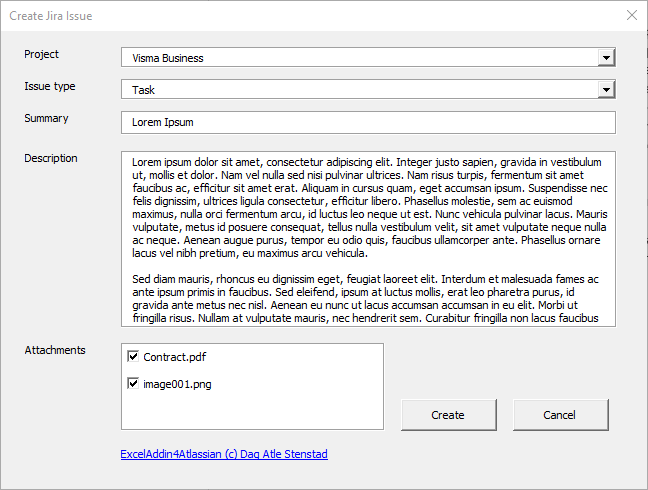
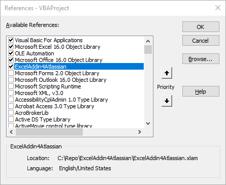

## ExcelAddin4Atlassian, Excel Add-in for the Atlasstian products Jira and Confluence


ExcelAddin4Atlassian is an open-source Excel Add-in that enables you to connect your Jira and Confluence data directly to Microsoft Excel. 
It is written in Visual Basic for Application (VBA) within Excel and saved as an Add-in, allowing you to utilize its functionality across all your Excel sheets.

# Installation
1. Downaload the latest [version of ExcelAddin4Atlassian](https://github.com/Dagiz007/ExcelAddin4Atlassian/archive/master.zip).
2. Unzip the file. 
3. Add ExcelAddin4Atlassian as a new [Add-in in Excel](https://support.office.com/en-us/article/add-or-remove-add-ins-in-excel-0af570c4-5cf3-4fa9-9b88-403625a0b460).
4. Start Excel og write this formula in a optional cell: **=OpenExcelAddin4AtlassianSettings()**
5. Fill in your Atlassian URL, username and password. Click <Ok> to save the change. 

#  Use/ formulas
Excel will provide suggestions as you write a formula. In the suggestion list, navigate with the arrow keys, press <Tab> to auto-complete, and <Tab> again to select. 
To view required or optional arguments for the selected function, press Ctrl + Shift + A.

**=OpenExcelAddin4AtlassianSettings()** Opens the Add-in Settings window where you can set:
* URL (URL to your instance)
* Email 
* [Token](https://id.atlassian.com/manage-profile/security/api-tokens)
* Enable logging (log all the rest API response)
* Log-path 

** Creates a new Jira issue.  
Example: =JiraCreateIssue("RISK"; "Task"; "My first issue"; "Created by ExcelAddin4Atlassian")

**=JiraDownloadIssuesAttachments(jql, path)** Downloads all Jira attachments based on a JQL search string to a defined folder.

**=JiraGetIssue(key)** Retrieves Jira issues based on the selected key.
Example: =JiraGetIssue("TSU-789")

**=JiraGetIssueDaysInTransitions(JiraKey; statuses)** Returns the number of days the issue has been in one or more statuses.
Example: =JiraGetIssueDaysInTransitions("TE-1"; "Development, Testing")

**=JiraGetIssues(jql)** Gets all Jira issues based on a JQL search string.

**==JiraOpenCreateIssueForm()** Opens a form to create a new Jira issue.




# Write your own code
Enable ExcelAddin4Atlassian in your VBA Reference list to use the ExcelAddin4Atlassian code library.



The example below goes through all Confluence pages and replaces one string with another.

```VBA
Sub Start()
      
    Dim fromText As String
    Dim toText As String
    
    fromText = "https://old_url.com/"
    toText = "https://new_url.com/"
    
    Dim pages As Collection
    Dim page As clsConfluencePage
    
    Set pages = confluence.getPages
    
    
    For Each page In pages
        DoEvents
        
        If InStr(1, page.body, fromText) > 0 Then
            page.body = Replace(page.body, fromText, toText)
            
            Call confluence.updateConfluenceContent(page.ID, page.Status, page.Title, page.body, page.Version + 1)
        End If
    Next
    
    
    Set pages = Nothing
    Set page = Nothing
    
    MsgBox "Finish"
   
End Sub
```